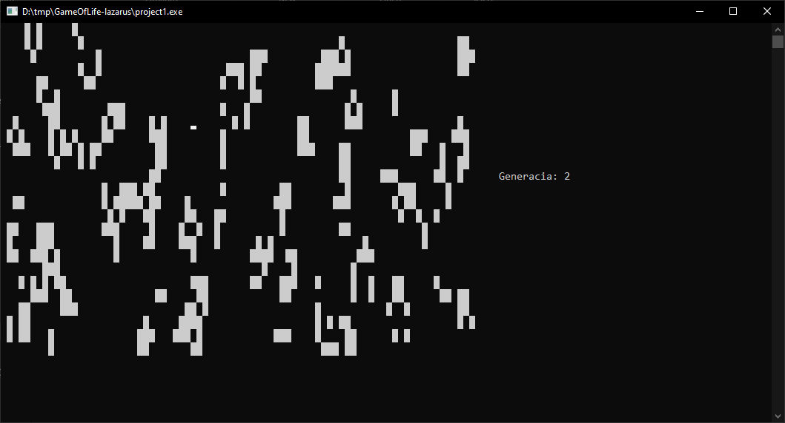

# Conway's Game of Life

This Pascal program simulates Conway's Game of Life, a cellular automaton devised by mathematician John Conway. The game consists of an infinite two-dimensional grid of cells, each of which can be in one of two states: alive or dead. The cells evolve based on a set of rules in each generation.

## Rules

1. **Underpopulation:** A live cell with fewer than two live neighbors dies.
2. **Stasis:** A live cell with two or three live neighbors survives.
3. **Overpopulation:** A live cell with more than three live neighbors dies.
4. **Reproduction:** A dead cell with exactly three live neighbors becomes alive.

## Program Features

### Initialization

-   The program initializes with a random configuration of live and dead cells.

### Generation Update

-   In each generation, cells are updated based on the rules, creating dynamic patterns.
-   The program visualizes the evolution of the grid, highlighting live cells.

### User Interaction

-   The program displays the current generation count.
-   Press any key to exit the simulation and view the final state.

## Usage

1. **Run the Program:**

    - Execute the program, and the simulation will start with an initial random configuration.

2. **Observe Evolution:**

    - Watch as the cells evolve from generation to generation based on Conway's rules.

3. **Exit Simulation:**
    - Press any key to exit the simulation and view the final state of the grid.

## Screenshots

Feel free to explore different initial configurations and observe the fascinating patterns that emerge over generations!
